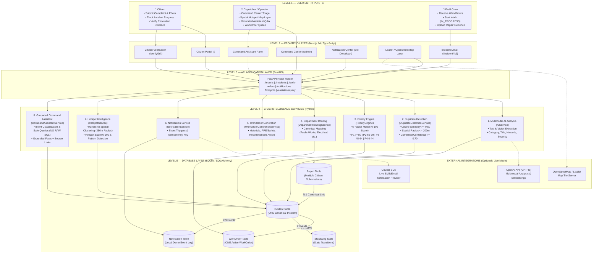

# CivicLens

## From Citizen Signal to Verified Civic Action

CivicLens is an AI-powered civic incident-resolution platform that transforms fragmented public complaints into unified, actionable municipal work orders and verifies their physical repair with citizens. By combining multimodal vision AI, spatial clustering, deterministic priority scoring, and closed-loop citizen verification, CivicLens bridges the gap between public reporting and municipal field operations—ensuring every pothole, broken signal, or storm drain hazard is accurately triaged, routed, resolved, and verified without administrative waste.

---

## 1. THE PROBLEM

Cities receive thousands of civic complaints daily through mobile apps, hotlines, and web portals. Municipal operations struggle with severe operational friction:

* **Duplicate Complaints:** A single major issue (like a dangerous pothole) generates dozens of individual citizen complaints, flooding dispatch queues.
* **Disconnected Reports:** Isolated reports lack spatial context, masking underlying systemic infrastructure failures.
* **Manual & Subjective Prioritization:** Emergency hazards are frequently buried under routine maintenance requests due to first-come, first-served triage.
* **Incorrect Department Routing:** Reports are regularly misrouted between roads, utilities, and traffic departments, causing resolution delays.
* **Lack of Actionable Work Instructions:** Field crews receive vague text complaints without required materials, safety precautions, or exact location coordinates.
* **Poor Visibility into Problem Concentrations:** Municipal leaders lack geographic intelligence to detect emerging issue clusters before major failures occur.
* **Weak Citizen Feedback Loops:** Citizens rarely receive status updates or verification requests, damaging trust in local government.

---

## 2. THE SOLUTION

CivicLens provides a unified, end-to-end civic operations platform designed around a 10-stage lifecycle:

```
Citizen Report
      ↓
AI Understanding
      ↓
Duplicate Consolidation
      ↓
Explainable Priority
      ↓
Department Routing
      ↓
Actionable WorkOrder
      ↓
Notifications
      ↓
Hotspot Intelligence
      ↓
Command Assistant
      ↓
Citizen Verification
```

1. **Citizen Report:** Citizens submit text descriptions and photos via a responsive web portal.
2. **AI Understanding:** Multimodal GPT-4o vision/text analysis extracts incident categories, severity, hazards, and evidence.
3. **Duplicate Consolidation:** Semantic embeddings and Haversine spatial algorithms consolidate duplicate reports into a single canonical Incident.
4. **Explainable Priority:** A 6-factor deterministic model calculates a transparent 0–100 priority score and assigns `P1_CRITICAL` through `P4_LOW` levels.
5. **Department Routing:** Canonical mapping automatically routes incidents to responsible departments (e.g., *Public Works - Roads*, *Traffic Management*).
6. **Actionable WorkOrder:** Automatically generates detailed work orders specifying recommended actions, required materials, and safety precautions.
7. **Notifications:** Multi-channel notification engine (Demo + Courier SDK) informs citizens and dispatchers as status changes.
8. **Hotspot Intelligence:** Radius-based spatial clustering identifies high-density problem areas and evaluates pattern types.
9. **Command Assistant:** Grounded, natural-language Q&A assistant answers operational questions using real database records without SQL injection risks.
10. **Citizen Verification:** Citizens inspect before/after repair evidence photos and confirm resolution, permanently closing the incident or reopening it if unresolved.

---

## 3. WHAT MAKES CIVICLENS DIFFERENT

### 1. Many Reports → One Canonical Incident
When multiple citizens report the same pothole or water leak, CivicLens does NOT create multiple competing work orders. Instead, it aggregates incoming reports under a single **Canonical Incident** while linking every report for evidence and report-volume weighting.

$$\text{5 Citizen Reports} \longrightarrow \text{1 Canonical Incident} \longrightarrow \text{1 Actionable WorkOrder}$$

### 2. Explainable Priority
Rather than relying on arbitrary LLM outputs, CivicLens uses a transparent, deterministic 6-factor mathematical model:
* **Severity** (30% weight)
* **Safety Risk** (25% weight)
* **Report Volume** (20% weight)
* **Duration / Aging** (10% weight)
* **Public Impact** (10% weight)
* **Evidence Confidence** (5% weight)

Every priority score (0–100) comes with an exact, auditable point breakdown.

### 3. Civic Hotspot Intelligence
CivicLens distinguishes between duplicates and hotspots:
* **Duplicate Detection:** *"Do these reports describe the exact same physical issue?"*
* **Hotspot Intelligence:** *"Are multiple distinct canonical incidents concentrated within a 250m radius?"*

Using Haversine distance clustering, CivicLens detects emerging infrastructure hotspots (e.g., multiple distinct potholes and signal glitches near a main gate) and ranks them by density and criticality.

### 4. Grounded Command Assistant
The Command Assistant provides natural-language Q&A for dispatchers using **predefined safe query functions**. It never generates raw SQL, never hallucinates data, and returns clickable source references back to exact database records.

### 5. Closed-Loop Citizen Verification
An incident is not closed when a contractor marks it "done." The reporting citizen receives a verification request containing before/after repair evidence photos. The citizen can either **Verify & Close** or **Reopen** the incident back to the operational queue.

---

## 4. CORE FEATURES

* **Multimodal AI Incident Analysis:** Extracts structured metadata, hazards, and recommended actions from text and photos.
* **Semantic & Geographic Duplicate Detection:** Combines cosine vector similarity ($\ge 0.50$) and Haversine spatial proximity ($\le 200\text{m}$).
* **Deterministic Priority Engine:** Calculates 0–100 priority scores and assigns `P1` to `P4` levels.
* **Department Routing Engine:** Maps incident categories to canonical municipal departments.
* **Actionable WorkOrder Generation:** Scaffolds structured work instructions, materials, and safety guidelines.
* **Closed-Loop Resolution State Machine:** Tracks `SUBMITTED → TRIAGED → ASSIGNED → IN_PROGRESS → RESOLVED → VERIFIED` states.
* **Multi-Channel Notification Abstraction:** Supports local Demo mode and production Courier SDK delivery with idempotency protection.
* **Spatial Hotspot Intelligence:** Density clustering ($250\text{m}$ radius) with score calculation ($0\text{--}100$) and pattern classification (`ROAD_CONDITION`, `DRAINAGE_CLUSTER`, `MIXED_INFRASTRUCTURE`).
* **Grounded Command Assistant:** Instant operational answers with clickable source cards.
* **Interactive Command Center Map:** Responsive Leaflet/OpenStreetMap layer rendering incident pins and translucent hotspot circles.

---

## 5. SYSTEM ARCHITECTURE



---

## 6. TECH STACK

### Backend
* **Language & Framework:** Python 3.14 / FastAPI
* **Database & ORM:** SQLite / SQLAlchemy
* **Validation & DTOs:** Pydantic v2
* **Testing:** Pytest / Starlette TestClient
* **AI & Messaging:** OpenAI API (GPT-4o) / Courier Python SDK

### Frontend
* **Framework:** Next.js 14 (App Router) / React 18 / TypeScript
* **Styling & UI:** Tailwind CSS / Lucide React Icons
* **Mapping:** Leaflet / OpenStreetMap

---

## 7. AI ARCHITECTURE

CivicLens maintains a strict boundary between AI vision extraction and deterministic decision engines:

### AI Extraction Layer (GPT-4o Vision/Text)
* **Input:** Citizen text description + uploaded evidence photo.
* **Output:** Category, title, normalized description, severity level, hazards list, evidence observations, AI confidence score ($0.0\text{--}1.0$), and recommended action.

### Deterministic Rule Engines (Non-AI)
* **Duplicate Matching:** Cosine vector similarity + Haversine distance formula.
* **Priority Score:** 6-factor weighted mathematical equation.
* **Department Routing:** Canonical dictionary lookup.
* **Hotspot Score:** Density and priority mathematical formula.
* **Lifecycle State Transitions:** Strict state-machine validation.

---

## 8. DUPLICATE DETECTION

Duplicate detection evaluates candidates using three criteria:
1. **Geographic Proximity:** Haversine distance $\le 200.0\text{m}$.
2. **Semantic Similarity:** Vector embeddings cosine similarity $\ge 0.50$.
3. **Category Compatibility:** Matches exact or compatible incident categories.

$$\text{Combined Confidence} = (\text{Spatial Score} \times 0.40) + (\text{Semantic Score} \times 0.60)$$

If Combined Confidence $\ge 0.70$, the submission is automatically consolidated into the existing Canonical Incident, incrementing its report count and updating its priority score.

---

## 9. PRIORITY ENGINE

The Priority Engine evaluates incidents on a $0\text{--}100$ scale using configured factor weights:

| Factor | Weight | Description |
| :--- | :--- | :--- |
| **Severity** | $0.30$ | Severity level (`CRITICAL` = 100, `HIGH` = 75, `MEDIUM` = 50, `LOW` = 25) |
| **Safety Risk** | $0.25$ | Safety hazards count and criticality |
| **Report Volume** | $0.20$ | Number of citizen reports linked to canonical incident |
| **Duration** | $0.10$ | Hours elapsed since incident creation |
| **Public Impact** | $0.10$ | Estimated public exposure and arterial traffic impact |
| **Evidence Confidence** | $0.05$ | AI vision confidence score |

### Priority Thresholds
* **`P1_CRITICAL`**: Score $\ge 80$ (Immediate emergency dispatch)
* **`P2_HIGH`**: Score $65\text{--}79$ (High priority dispatch)
* **`P3_MEDIUM`**: Score $45\text{--}64$ (Standard queue)
* **`P4_LOW`**: Score $0\text{--}44$ (Routine maintenance)

---

## 10. HOTSPOT INTELLIGENCE

Civic Hotspot Intelligence groups distinct canonical incidents within a $250\text{m}$ radius:

* **Unit of Intelligence:** Canonical `Incident` records (NOT individual reports).
* **Radius:** $250\text{m}$ (`HOTSPOT_RADIUS_METERS = 250.0`).
* **Min Criteria:** $\ge 3$ canonical incidents OR $\ge 5$ total reports across $\ge 2$ canonical incidents.
* **Hotspot Score (0–100):** Weighted combination of incident density, report volume, average priority score, and P1/P2 criticality counts.
* **Hotspot Levels:** `CRITICAL` ($\ge 80$), `HIGH` ($60\text{--}79$), `EMERGING` ($40\text{--}59$), `NORMAL` ($0\text{--}39$).
* **Pattern Classification:** Automatically categorizes patterns into `ROAD_CONDITION`, `DRAINAGE_CLUSTER`, `LIGHTING_CLUSTER`, `WATER_INFRASTRUCTURE`, `SANITATION_CLUSTER`, `ELECTRICAL_CLUSTER`, or `MIXED_INFRASTRUCTURE`.

*Note: A single incident with 15 reports is NOT a spatial hotspot. Hotspots require spatial concentration across multiple distinct incidents.*

---

## 11. CLOSED-LOOP WORKFLOW

CivicLens enforces a strict lifecycle state machine:

$$\text{SUBMITTED} \longrightarrow \text{TRIAGED} \longrightarrow \text{ASSIGNED} \longrightarrow \text{IN\_PROGRESS} \longrightarrow \text{RESOLVED} \longrightarrow \text{VERIFIED}$$

* **Citizen Reopening:** If a citizen marks the repair unsatisfied on `/verify/[id]`, the state transitions from `RESOLVED → IN_PROGRESS`, reopening the associated WorkOrder and sending a notification back to field crews.
* **Terminal State:** `VERIFIED` is terminal and permanently closes the incident.

---

## 12. NOTIFICATIONS

CivicLens features a multi-channel notification engine:
* **Notification Modes:** Configurable via `NOTIFICATION_MODE=demo` (local SQLite event log) or `NOTIFICATION_MODE=courier` (live Courier SDK integration).
* **Idempotency:** Generates deterministic idempotency keys (`event_type:incident_id:recipient_type`) passed via `extra_headers={"Idempotency-Key": key}` to prevent duplicate messages.
* **In-App Notification Center:** Real-time bell counter and dropdown in top navigation bar displaying event type, demo badge, time-ago formatting, and direct links.

---

## 13. COMMAND ASSISTANT

The Command Assistant provides grounded Q&A for dispatchers without raw SQL risks:
* **Predefined Safe Queries:** `get_top_priority_incidents()`, `get_hotspots()`, `get_incident_explanation()`, `get_department_workload()`, `get_status_summary()`.
* **Supported Questions:**
  * *"What should we fix first?"*
  * *"Where are the biggest civic hotspots?"*
  * *"Why is the top incident P1?"*
  * *"Which department has the most active work?"*
  * *"How many incidents are awaiting verification?"*
* **Source-Linked Answers:** Every answer includes clickable source cards linking directly to `/incident/[id]` or hotspot drill-down modals.

---

## 14. SECURITY

* **File Upload Security:**
  * Extension Whitelist (`.jpg`, `.jpeg`, `.png`, `.webp`, `.gif`)
  * Content-Type MIME Validation (`image/jpeg`, `image/png`, `image/webp`, `image/gif`)
  * Header Magic Byte Signature Inspection (`\xFF\xD8\xFF`, `\x89PNG`, `GIF87a`/`GIF89a`, `RIFF...WEBP`)
  * Maximum File Size Limit ($10\text{ MB}$)
  * Sanitized UUID Filenames (prevents path traversal attacks)
* **Input Validation:** Strict Pydantic v2 schemas on all API endpoints.
* **No Raw SQL Generation:** Eliminates SQL injection risks in AI assistant queries.
* **Environment Secrets:** API keys loaded strictly via environment variables.

---

## 15. PROJECT STRUCTURE

```
CivicLens/
├── backend/
│   ├── app/
│   │   ├── api/
│   │   │   └── v1/
│   │   │       └── endpoints.py
│   │   ├── core/
│   │   │   ├── config.py
│   │   │   └── enums.py
│   │   ├── db/
│   │   │   ├── init_db.py
│   │   │   └── session.py
│   │   ├── models/
│   │   │   └── entities.py
│   │   ├── schemas/
│   │   │   └── dto.py
│   │   └── services/
│   │       ├── ai_service.py
│   │       ├── command_assistant_service.py
│   │       ├── crud.py
│   │       ├── duplicate_service.py
│   │       ├── hotspot_service.py
│   │       ├── notification_service.py
│   │       ├── priority_routing_service.py
│   │       └── work_order_service.py
│   ├── tests/
│   │   ├── test_command_assistant.py
│   │   ├── test_duplicate_integration.py
│   │   ├── test_duplicate_service.py
│   │   ├── test_hotspot_service.py
│   │   ├── test_notifications.py
│   │   ├── test_priority_routing.py
│   │   ├── test_upload_security.py
│   │   ├── test_verification_integration.py
│   │   └── test_work_order_service.py
│   ├── .env.example
│   ├── main.py
│   └── requirements.txt
├── frontend/
│   ├── src/
│   │   ├── app/
│   │   │   ├── admin/page.tsx
│   │   │   ├── incident/[id]/page.tsx
│   │   │   ├── verify/[id]/page.tsx
│   │   │   ├── layout.tsx
│   │   │   └── page.tsx
│   │   ├── components/
│   │   │   └── ui/
│   │   │       ├── LeafletMap.tsx
│   │   │       ├── Navigation.tsx
│   │   │       └── NotificationCenter.tsx
│   │   ├── lib/
│   │   │   └── api.ts
│   │   └── types/
│   │       └── index.ts
│   ├── .env.example
│   ├── package.json
│   └── tailwind.config.ts
├── .latentcode/
│   └── skills/
│       └── courier-notification-skills/
└── README.md
```

---

## 16. LOCAL SETUP

### Prerequisites
* Python 3.10+
* Node.js 18+ & npm

### 1. Backend Setup
```bash
cd backend
python -m venv venv
# On Windows:
venv\Scripts\activate
# On Linux/macOS:
source venv/bin/activate

pip install -r requirements.txt
cp .env.example .env
```

### 2. Database Reset & Seeding
```bash
python -m app.db.init_db
```

### 3. Start Backend Server
```bash
python main.py
# Backend API runs at http://localhost:8000/api/v1
```

### 4. Frontend Setup
```bash
cd ../frontend
npm install
cp .env.example .env.local
npm run dev
# Frontend web portal runs at http://localhost:3000
```

---

## 17. ENVIRONMENT VARIABLES

### Backend (`backend/.env.example`)

```env
# Database
DATABASE_URL=sqlite:///./civiclens.db

# CORS Policy
BACKEND_CORS_ORIGINS=["http://localhost:3000","http://127.0.0.1:3000"]

# AI Demo Mode (Default: true for fully local execution without OpenAI key)
AI_DEMO_MODE=true

# OpenAI Configuration (Optional: required only for live GPT-4o vision/text analysis)
OPENAI_API_KEY=your_openai_api_key_here
OPENAI_MODEL=gpt-4o
OPENAI_EMBEDDING_MODEL=text-embedding-3-small

# Notification Mode (Default: "demo" for local SQLite event log; set to "courier" for live Courier SDK)
NOTIFICATION_MODE=demo
COURIER_API_KEY=
COURIER_NOTIFICATION_TEMPLATE_ID=

# Hotspot Intelligence Tuning
HOTSPOT_RADIUS_METERS=250.0
HOTSPOT_MIN_INCIDENTS=3
HOTSPOT_MIN_REPORTS=5
```

---

## 18. TESTING

### Backend Test Suite
```bash
cd backend
python -m pytest -q
```

**Verified Pytest Results:**
* `62 collected`
* `62 passed`
* `0 failed`
* `0 skipped`
* `0 errors`
* Execution time: $12.09\text{ seconds}$

### Frontend Production Build
```bash
cd frontend
npm run build
```
**Verified Build Result:** `Compiled successfully` ($5/5$ static/dynamic routes generated without errors).

---

## 19. DEMO SCENARIO (GOLDEN PATH)

1. **Hero Incident:** `Large Hazardous Pothole near Gate 1` (`inc-demo-001-pothole`).
2. **Consolidation:** 5 citizen reports aggregated under 1 canonical incident.
3. **Priority:** `P1_CRITICAL` (Score: `91/100`).
4. **Department Routing:** `Public Works - Roads`.
5. **WorkOrder:** `wo-demo-001` (Status: `IN_PROGRESS`).
6. **Hotspot Association:** Belongs to `hs-001` (`100 Gate 1 Way, Main Entrance`, Level: `CRITICAL`, Score: `91`).
7. **Notifications:** Event `INCIDENT_PRIORITY_ALERT` logged.
8. **Field Resolution & Verification:** Dispatcher completes work order with evidence photo $\rightarrow$ Incident status changes to `RESOLVED` $\rightarrow$ Citizen opens `/verify/inc-demo-001-pothole` $\rightarrow$ Citizen clicks **Verify Fixed** $\rightarrow$ Incident permanently transitions to `VERIFIED`.

---

## 20. SKILLPATCH USAGE

CivicLens integrates the verified SkillPatch skill:

* **Installed Skill:** `courier-notification-skills` (Location: `.latentcode/skills/courier-notification-skills/`)
* **Provided Capabilities:**
  * Official Courier Python SDK integration patterns.
  * Multi-channel notification message formatting (SMS, Email, Push, In-App).
  * Idempotency protection using `extra_headers={"Idempotency-Key": key}`.
* **Local Fallback:** Supports `NOTIFICATION_MODE=demo` allowing the complete notification workflow to be demonstrated locally without requiring external API credentials.

---

## 21. LIMITATIONS & FUTURE WORK

* **Municipal Authentication & RBAC:** Current MVP uses role simulation for Citizens, Dispatchers, and Field Teams. Production deployment would integrate OAuth2/OIDC and role-based access control.
* **Production Storage:** Local storage `/uploads/` would be migrated to Azure Blob Storage or AWS S3.
* **PostGIS Geospatial Engine:** For city-scale deployments with millions of records, Haversine clustering can be upgraded to PostGIS spatial indexing.
* **Live SMS/Push Providers:** Integration with live regional SMS gateways for direct citizen text messaging.

---

## 22. LICENSE

Distributed under the MIT License. See `LICENSE` for details.
